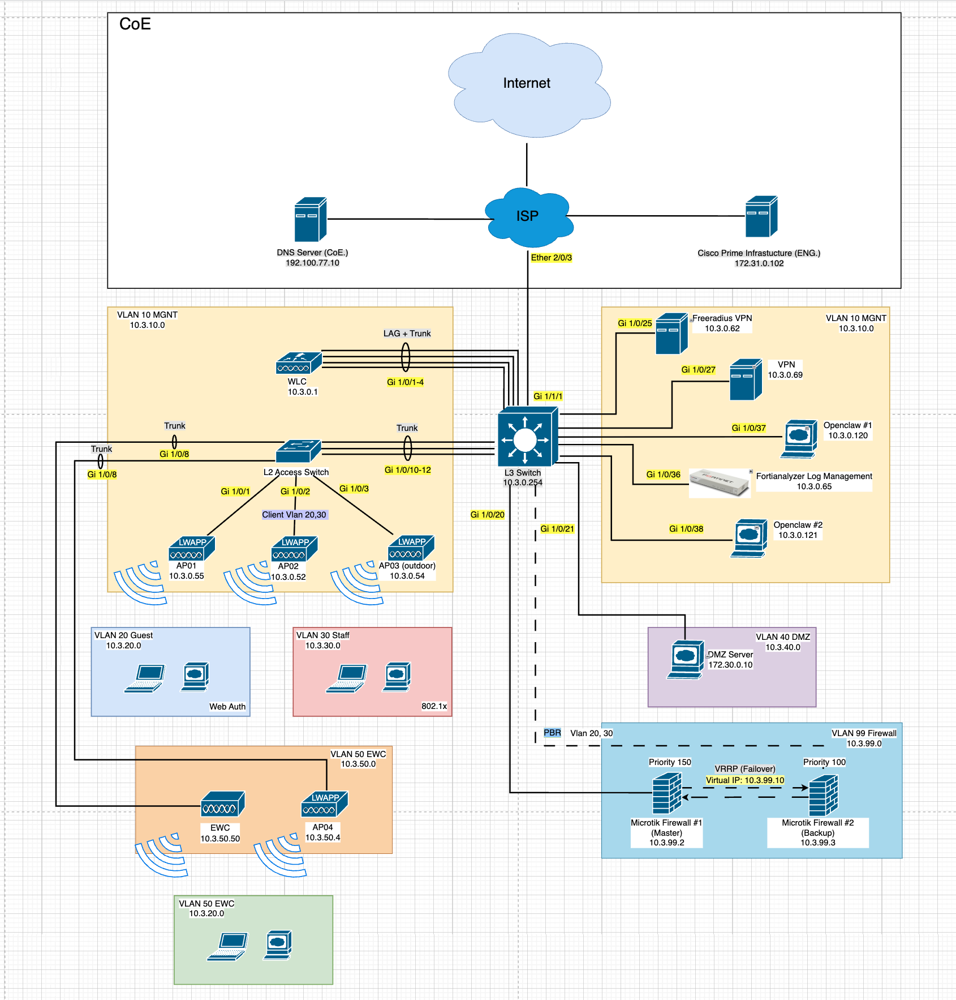

# 240-351 Network Infrastructure Module — Group 03

## Topology



---

## อุปกรณ์และ IP Address

| อุปกรณ์ | รุ่น | IP Address |
|---|---|---|
| L3 Switch | Cisco C9200L-48T-4G | 10.3.0.254 |
| L2 Access Switch | Cisco WS-C2960X-48FPS-L | — |
| WLC | Cisco AIR-CT2504 | 10.3.0.1 |
| EWC | Cisco C9800-AP | 10.3.50.50 |
| MikroTik FW #1 (Master) | RB951Ui-2HnD | 10.3.99.2 |
| MikroTik FW #2 (Backup) | RB951Ui-2HnD | 10.3.99.3 |
| VRRP Virtual IP | — | 10.3.99.10 |
| Freeradius (Raspberry Pi) | — | 10.3.0.62 |
| Tailscale VPN (Raspberry Pi) | — | 10.3.0.69 |
| FortiAnalyzer 100C | — | 10.3.0.65 |
| DMZ Web Server | — | 172.30.0.10 |
| AP01 | AIR-AP2802I | 10.3.0.55 |
| AP02 | AIR-AP1815M | 10.3.0.53 |
| AP03 (Outdoor) | AIR-AP1562I | 10.3.0.54 |

---

## VLAN

| VLAN | ชื่อ | Subnet | หมายเหตุ |
|---|---|---|---|
| 10 | MGMT | 10.3.0.0/24 | Management |
| 20 | Guest | 10.3.20.0/24 | Web Auth |
| 30 | Staff | 10.3.30.0/24 | 802.1x |
| 40 | DMZ | 172.30.0.0/24 | Web Server |
| 50 | EWC/AP | 10.3.50.0/24 | Wireless AP |
| 99 | Firewall Transit | 10.3.99.0/24 | MikroTik |

---

## SSID (Wireless)

| SSID | Controller | VLAN | Security |
|---|---|---|---|
| Group03 | WLC | 20 (Guest) | WPA2-PSK |
| Corporate03 | WLC | 30 (Staff) | WPA2 |
| Group03-Admin | EWC | — | WPA2-PSK |

---

## การทำงานหลัก

**Firewall (MikroTik)**
- VRRP Failover ระหว่าง FW #1 (Priority 150) และ FW #2 (Priority 100)
- บล็อก Facebook, Messenger (DNS NXDOMAIN)
- บล็อก Discord อัตโนมัติ (Address List)
- บล็อก Port อันตราย: Telnet (23), SMTP (25), NetBIOS (139), SMB (445)
- NAT Masquerade สำหรับออก Internet

**L3 Switch**
- Policy-Based Routing (PBR) ส่ง Traffic VLAN 20/30 ไป MikroTik
- ACL ป้องกัน VLAN 20/30 เข้า MGMT Network
- DHCP Server สำหรับทุก VLAN
- Log ส่งไป FortiAnalyzer (10.3.0.65)

**Wireless**
- WLC จัดการ AP 3 ตัว (AP01, AP02, AP03 Outdoor)
- EWC (Embedded WC บน AP) จัดการ VLAN 50

---

## โครงสร้าง Repository

```
├── Config-Plaintext/       # Config ของอุปกรณ์แต่ละตัว
│   ├── L3-Config.txt
│   ├── L2-config.txt
│   ├── WLC-Config.txt
│   ├── EWC-Config.txt
│   ├── Microtik-Firewall-Config#1.txt
│   └── Microtik#2-Firewall-Config.txt
├── Topology/               # ไฟล์ Topology
│   ├── Topology.png
│   └── Network_touch_Topology.drawio
├── Doc+Datasheet/          # เอกสารและ Datasheet
└── Web-login/              # หน้า Web Login (Captive Portal)
```
